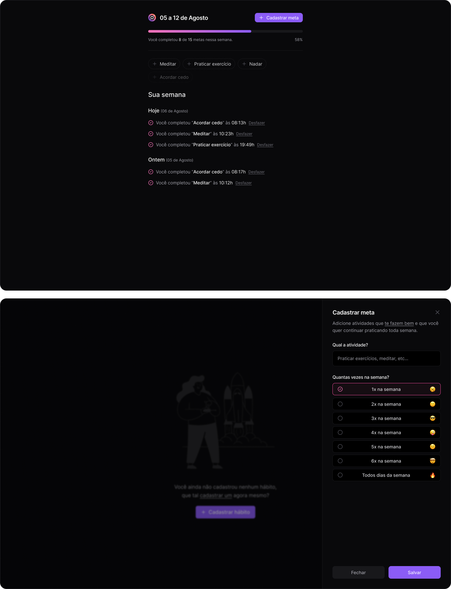

# 🎯 in.orbit

> Uma aplicação moderna para gerenciamento de metas semanais

<div align="center">
  
</div>

<div align="center">
  
[](https://www.typescriptlang.org/)
[](https://reactjs.org/)
[](https://nodejs.org/)
[](https://www.postgresql.org/)

</div>

## 📋 Sobre o Projeto

**in.orbit** é uma aplicação full-stack para gerenciamento de metas semanais, permitindo que usuários definam objetivos, acompanhem seu progresso e mantenham o foco em suas conquistas pessoais e profissionais.

Desenvolvido durante o **NLW Pocket: Javascript** da [Rocketseat](https://www.rocketseat.com.br/), o projeto demonstra a implementação de uma arquitetura moderna com React no front-end e Node.js no back-end.

### 🎥 Preview

<div align="center">
  
</div>

## ✨ Funcionalidades

- 🎯 **Cadastro de Metas**: Crie metas personalizadas com frequência semanal
- 📊 **Acompanhamento Visual**: Visualize seu progresso com indicadores intuitivos
- ✅ **Marcação de Conclusão**: Marque metas como concluídas com um clique
- 📱 **Interface Responsiva**: Design adaptável para desktop e mobile
- 🔄 **Sincronização em Tempo Real**: Dados sempre atualizados

## 🛠️ Tecnologias

### Front-end
- **[React](https://react.dev/)** - Biblioteca para interfaces de usuário
- **[TypeScript](https://www.typescriptlang.org/)** - Superset tipado do JavaScript
- **[TailwindCSS](https://tailwindcss.com/)** - Framework CSS utilitário
- **[React Query](https://tanstack.com/query/latest)** - Gerenciamento de estado para requisições
- **[Vite](https://vitejs.dev/)** - Build tool moderna e rápida

### Back-end
- **[Node.js](https://nodejs.org/)** - Runtime JavaScript
- **[Fastify](https://fastify.dev/)** - Framework web rápido e eficiente
- **[Drizzle ORM](https://orm.drizzle.team/)** - ORM TypeScript-first
- **[PostgreSQL](https://www.postgresql.org/)** - Banco de dados relacional
- **[Zod](https://zod.dev/)** - Validação de schemas TypeScript

### Ferramentas de Desenvolvimento
- **[Biome](https://biomejs.dev/)** - Linter e formatter
- **[Docker](https://docker.com/)** - Containerização (opcional)

## 📁 Estrutura do Projeto

```
in.orbit/
├── 📁 server/          # Backend (API)
│   ├── 📁 src/
│   │   ├── 📁 routes/
│   │   ├── 📁 db/
│   │   └── 📁 schemas/
│   └── 📄 package.json
├── 📁 web/             # Frontend (React)
│   ├── 📁 src/
│   │   ├── 📁 components/
│   │   ├── 📁 hooks/
│   │   └── 📁 services/
│   └── 📄 package.json
└── 📄 README.md
```

## 🚀 Como Instalar

```bash
# Clone o repositório
git clone https://github.com/seu-usuario/in.orbit.git
cd in.orbit

# Backend
cd server
npm install
npm run dev

# Frontend (em outro terminal)
cd ../web
npm install
npm run dev
```


<div align="center">
  
**Desenvolvido com 💜 durante o NLW Pocket da [Rocketseat](https://www.rocketseat.com.br/)**

</div>
